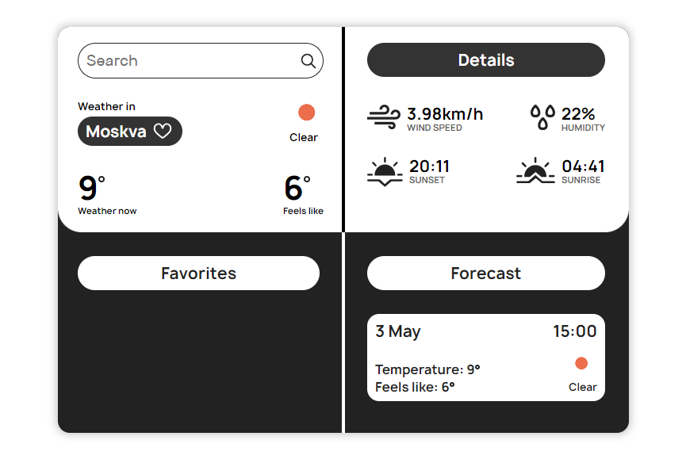

## Скриншот программы

## О приложении

Weather - это приложение которое отображает погоду в зависимости от заданного города.

## Функции программы

- Поиск погоды:
  - Тип погоды
  - Температура сейчас
  - Температура как чувствуется
  - Скорость ветра
  - Влажность
  - Время рассвета
  - Время заката
- Сохранение города в избранное:
  - Поиск погоды при нажатии на избранный город
  - Удаление из избранног
- Прогноз погоды на 7 дней:
  - Дата
  - Время
  - Тип погоды
  - Температура сейчас
  - Температура как чувствуется

## Технологии

- HTML
- CSS
- JavaScript

## Ссылки

Демонстрация - [Weather](https://kustiche.github.io/PetWeather/)
